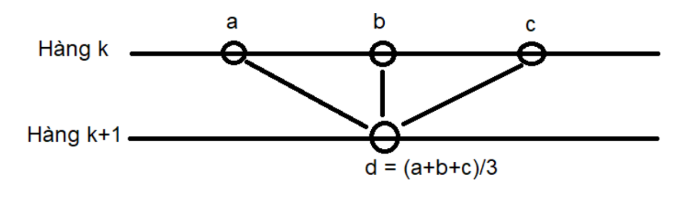

# Numpy exercises

## Bài tập 1: Thao tác cơ bản

- Tạo mảng 1 chiều $x$ gồm n số thực
- Chọn 3 hàm số tuỳ ý $f_1(x)$, $f_2(x)$, $f_3(x)$. Tạo 3 mảng bằng cách truyền $x$ vào trong 3 hàm số.
- Ghép bốn mảng một chiều thành một mảng hai chiều kích thước $n\times4$

## Bài tập 2: Thống kê cơ bản

- Tải dữ liệu file `heart_rate.txt` vào trong mảng `a`
- Thực hiện mô tả thống kê với các biến `Time` và `Heart Rate`: Cỡ mẫu, trung bình, trung vị, độ lệch chuẩn, giá trị lớn nhất, nhỏ nhất, phần tư Q1, Q2 và Q3

## Bài tập 3: Thao tác với mảng

- Tạo một mảng 2-chiều `a` cỡ $m\times n$
- Các phần tử hàng đầu tiên chạy từ `1` $\longrightarrow$ `n`
- Các phần tử cột đầu tiên nhận giá trị bằng `1`
- Các phần tử cột cuối cùng nhận giá trị bằng `n`
- Các phần tử còn lại tính theo mô tả sau
  

## Bài tập 4: Vector hoá và tối ưu

Bài tập này sẽ cho các bạn thấy được việc vector hoá quá trình tính toán sẽ tăng tốc độ hiệu quả tới mức nào

Trong bài tập này, các bạn cũng sẽ được giới thiệu với một thuật toán Machine Learning (nhưng các bạn hiện tại chưa cần hiểu nó đang làm gì)

1. Bài tập này gồm 2 file: Một file Jupyter notebook `knn.ipynb` và một file Python `k_nearest_neighbor.py` chứa phần code các bạn sẽ phải implement
2. Trong notebook, biến `num_training` là số phần tử của tập training cho mô hình. Đối với vài tập numpy này, nó là số chiều thứ nhất của ma trận mà các bạn sẽ phải tính toán (property `X_train` của class `KNearestNeighbor`). Chiều còn lại của ma trận này là dữ liệu ảnh đã được "flatten" (biến từ ma trận nhiều chiều thành vector), có kích thước ~3000
3. Biến `num_training` ban đầu được đặt là 2000, nghĩa là chỉ lấy 2000 ảnh cho việc huấn luyện và chỉ tính toán với 2000 vector đối với numpy. Hãy thử implement numpy đối với các hàm được yêu cầu trong class này đối với số luọng dữ liệu này trước.

    Bài tập có yêu cầu các bạn tính toán [khoảng cách L2](https://vi.wikipedia.org/wiki/Kho%E1%BA%A3ng_c%C3%A1ch_Euclid). Các bạn có thể tham khảo thêm về cách tính khoảng cách này [ở đây](https://www.geeksforgeeks.org/calculate-the-euclidean-distance-using-numpy/)

4. Tối ưu hoá: Yêu cầu của bài tập này là thuật toán phải hoạt động hiểu quả với số `num_training` _ít nhất_ là __5000__. Các bạn có thể kiểm tra implementation của mình đối với toàn bộ dữ liệu đã có (50000 ảnh)

    Các bạn có máy tính RAM to có thể không gặp vấn đề gì với 2000 ảnh, nhưng với 5000 ảnh gần như chắc chắc các implementation kiểu "hacker" một dòng sẽ đều gặp phải vấn đề. Mình cũng đã bị dính lỗi như vậy

5. Thời gian: Trong cell code cuối của notebook có phần so sánh thời gian thực hiện thuật toán. Với implementation của mình thì thời gian xử lý 5000 ảnh giảm từ ~1 phút (đối với implementation loop) xuống còn ~0.4s. Từ đây các bạn sẽ thấy được sức mạnh của việc tính toán bằng numpy và xử lý vector hoá.
